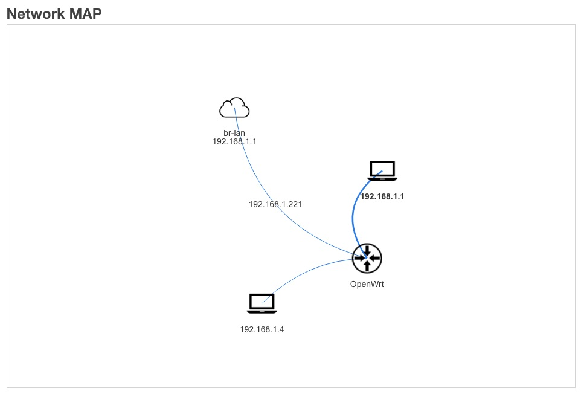

# luci-app-netmap

## Features

Shows a network diagram with all detected machines and physical connections:

## Install

1. Download the ipk on the release tab
2. install using `opkg install luci-app-netmap-*.ipk`

## Build

1. Git clone this repository in your `package` directory.
2. `make menuconfig` and select luci-app-netmap in LUCI category and save.
3. `make package/luci-app-netmap/compile` with a single package.
